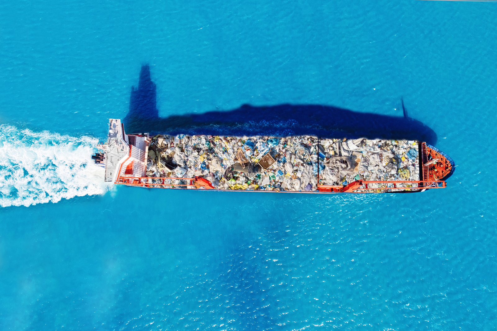
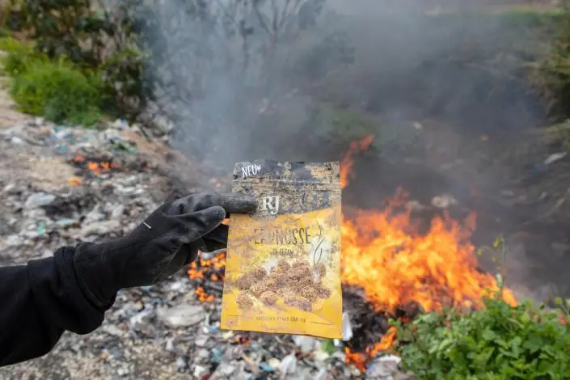

---
# You can also start simply with 'default'
theme: seriph
# random image from a curated Unsplash collection by Anthony
# like them? see https://unsplash.com/collections/94734566/slidev
background: plastic-ocean-background-2.jpg
# some information about your slides (markdown enabled)
# title: Müllrecycling in Deutschland auf Kosten anderer Länder?
# info: |
#  Idk bro
# apply unocss classes to the current slide
class: text-center
# https://sli.dev/features/drawing
drawings:
  persist: false
# slide transition: https://sli.dev/guide/animations.html#slide-transitions
transition: slide-left
# enable MDC Syntax: https://sli.dev/features/mdc
mdc: true
# take snapshot for each slide in the overview
overviewSnapshots: true
hideInToc: true
---

<h1>Müllrecycling in Deutschland<br>auf Kosten anderer Länder?<br>Am Beispiel Plastikmüll</h1>

#### Von Markus Siegert

<style>
h1 {
  all: initial;
  font-size: 2em !important;
  line-height: 1.2 !important;
}

h4 {
  font-size: 1em !important;
}
</style>

<!--
Hallo Leute! Grr 'Leute' ich weiss kleiner Spass als Einleitung zu einem eher
Duesteren Thema

Kein interkultureller Zusammenhalt, sondern schlechte Abhaengigkeiten zwischen den Laendern.
-->

---
transition: fade-out
hideInToc: true
---

# Gliederung

<Toc minDepth="1" maxDepth="2"></Toc>

<!--
Als erstes wie mit dem Plastikmuell in Deutschland umgegangen wird.

Was recycling wirklich bedeutet.

und danach wie es die anderen Laender betrifft.
-->

---
transition: slide-up
---

# Plastikmüll in Deutschland


<!-- 60% aus Verpackungen -->

<style>
.center {
  display: block;
  margin-left: auto;
  margin-right: auto;
  width: 75%;
}
</style>

<!-- hier sind normale stats wie viel allgemein in deutschland und dann nochmal wie viel plastik und dann wie viel plastik exportiert wird -->
<!-- https://www.umweltbundesamt.de/daten/ressourcen-abfall/abfallaufkommen (Allgemeine Stats) -->
<!-- https://www.nabu.de/umwelt-und-ressourcen/abfall-und-recycling/26205.html (Stats zu exporten und plastik) -->
<!-- https://www.greenpeace.de/engagieren/nachhaltiger-leben/plastikmuellexporte-deutschland (experte am werk) -->

<!-- plastik exportiert zu 'anerkannten' recycling stationen im ausland zaehlt zur deutschen recycling quote. ( 2 ) -->
<!-- cool story firma in de exportiert nach tuerkei illegalen muell und geht insolvent. Muell bleibt in Tuerkei. ( 3 ) -->
<!-- 2.8% des Plastikmuells wird recycled. ( 3 ) -->
<!-- Basler Konvention -->
<!-- Die Recycling Luege -->
<!-- min 7 Expertenargument gegen Recycling warum es nicht funktionieren kann -->
<!-- min 8.15 6 millionene tonnen plastik muell -->
<!-- min 15 2.8% (3) - 5% aus dem gelben Sack werden wieder zu verwendbaren plastik gemacht. Grund ist zu schmutzige sachen wie Chips, Joghurt und gemuese schalen. -->
<!-- min 16 grosse firmen nehmen lieber billigeres material was direkt aus der produktion kommt. anstatt teures recyclestes material. -->
<!-- min 16.20 400 millionen neu plastik durch eine Produktionsstaette | geschaetzt 20% des Oels fuer plastik -->
<!-- min 19 Mischkunststoffe koennen nicht recycled werden. Man kann nicht aus Scheisse Gold machen, ausserdem stinkt das Zeug. Es gibt aber anwendungen dafuer naemlich z.b. eisenbahnschwellen. Aber selbst das ist nicht profitabel. -->
<!-- min 24 so verschmutzt dass eine stoffliche recyclung nicht mehr stattfinden kann und thermisch verwertet wird. Erstmal zerhackt und dann als ersatzbrennstoff genutzt. 70% des Brennstoffs von Zementherstellung wird so gewonnen. -->
<!-- min 26 Zementherstellung hat 3 mal mehr THG ausstoss als Flugzeuge betrieb -->
<!-- min 29 Energiegewinnung aus Restmuell und deswegen gruen. Nicht weil es umweltfreundlich ist, sondern weil es das Plastikproblem teilweise loest. -->
<!-- min 31 Exportierter Muell gilt auch als recycled -->
<!-- min 32 China hat dicht gemacht und jetzt andere laender wie Malaisia, Phillipinen usw aber die beschraenken jetzt auch. (Merkt man an der Quelle nabu in dem einen Jahr waren es 170 Tonnen in dem anderen nur noch 65 tonnen) -->
<!-- min 32.5 Tuerkei als haupt importer. und illegal ohne filter verbrannt. -->
<!-- min 45 es wird immer schwerer Mischkunststoffe zu exportieren (illegal) -->
<!-- Recycling ist die Illusion man hat ein Problem und Technologie loest sie aus Zauberhand. -->
<!-- Durch diese Fehlannahme wird es zu keiner wirklichen loesung kommen koennen denn es ist ja schon faelschlicherweise geloest. -->

<!-- |     |     | -->
<!-- | --- | --- | -->
<!-- | <kbd>right</kbd> / <kbd>space</kbd>| next animation or slide | -->
<!-- | <kbd>left</kbd>  / <kbd>shift</kbd><kbd>space</kbd> | previous animation or slide | -->
<!-- | <kbd>up</kbd> | previous slide | -->
<!-- | <kbd>down</kbd> | next slide | -->

<!-- <!-1- https://sli.dev/guide/animations.html#click-animation -1-> -->
<!-- 
<!--   v-click -->
<!--   class="absolute -bottom-9 -left-7 w-80 opacity-50" -->
<!--   src="https://sli.dev/assets/arrow-bottom-left.svg" -->
<!--   alt="" -->
<!-- /> -->

<!--
Die Grafik erklaeren

Links Pie Chart

Rechts Person von den Gesamten Kunststoffabfaellen.

Es wurde mit ca. 85 mio Einwohnern gerechnet.
-->

---
transition: slide-up
---

# Der Grüne Punkt
<v-switch class="midl">
  <template #0>
    
  </template>
  <template #1>
    <div class="vertical-center">
      <ul>
        <h2>Verwertung</h2>
        <li>5,67 Mio. t davon 99,4%, ca. 5,63 Mio. t werden Verwertet.
          <ul>
            <li>64,4% thermische Verwertung, ca. 3,651 Mio. t</li>
            <li>21,5% Herstellung von Kunststoffgranulat, ca. 1,219 Mio. t</li>
            <li>13,1% export ins Ausland, ca. 0,745 Mio. t</li>
            <li>0,4% echtes Recycling, ca. 22.680 t</li>
          </ul>
        </li>
      </ul>
      <br>
```
🔍 77,5% das sind ca. 4.421 Tonnen können nicht im Inland recycled werden.
```
    </div>
    <Footer />
  </template>
</v-switch>

<style>
.midl {
  position: relative;
  height: 70%;
}

.vertical-center {
  margin: 0;
  position: absolute;
  top: 50%;
  -ms-transform: translateY(-50%);
  transform: translateY(-50%);
  width: 100%;
}

.center {
  display: block;
  margin-left: auto;
  margin-right: auto;
  width: 75%;
}
</style>

<!--
Doch halt! Es gibt einen Retter in der Not. Der gruene Punkt.

Er verspricht, dass Verpackungen von Firmen die diesen erworben haben:

Abgeholt,

Sortiert,

und Verwertet werden.

Mit dem Geld welches zum erworb gezahlt wurde... Ja

Er existiert seit den 1990er Jahren und es ist fuer Firmen die Verpackungen verkaufen bzw. verschicken verpflichtend eine solche Lizenz zu erwerben. Es muss jedoch nicht der gruene Punkt sein.

Und wie sieht diese Verwertung aus?
-->

---
transition: slide-up
---

# Thermische Verwertung
<div class="grid grid-cols-[45%_10%_45%] gap-4" style="height: 60%">
  <!-- First column -->
  <div class="vertical-center">
    <div>
      <div>
        <p><strong>Aussortiertes Plastik</strong></p>
        <ul>
          <li>Zu verschmutztes Plastik wird aussortiert und zur Aufbereitung als Ersatzbrennstoff weitergeleitet.</li>
          <li>Müllaufbereiter zahlen für die Verbrennung.</li>
        </ul>
      </div>
    </div>
  </div>
  <!-- Second column -->
  <div class="arrow-container">
    🡒
  </div>
  <!-- Third column -->
  <div class="vertical-center">
    <div>
      <div>
        <p><strong>CO<sub>2</sub>-Ausstoß und Nutzung</strong></p>
        <ul>
          <li>Hohe CO<sub>2</sub>-Emissionen trotz Müllreduktion.</li>
          <li>Einsatz in Zementproduktion und Fernwärme.</li>
          <li>Zementindustrie: 3-fach höhere THG als Flugverkehr.</li>
        </ul>
      </div>
    </div>
  </div>
</div>

<Footer />

<style>
.center {
  display: block;
  margin-left: auto;
  margin-right: auto;
}
p {
  margin-top: 1rem;
  margin-bottom: 0rem;
}
.arrow-container {
  display: flex;
  justify-content: center;
  align-items: center;
  height: 100%;
  font-size: 5rem;
}
.vertical-center {
  display: flex;
  justify-content: center;
  align-items: center;
  height: 100%;
}
</style>

<!--
Aussortiertes Plastik

Also zu verschmutzt oder zu oft schon recycled

wird zuerst aufbereitet und dann mit gewissem entgelt als Ersatzbrennstoff weitergeleitet.

Aber nicht der Verheizende zahlt, neee. Der Muellaufbereiter zahlt damit der mindere Ersatzbrennstoff ueberhaupt in Betracht gezogen wird verbrannt zu werden.

Das muss man sich erstmal auf der Zunge zergehen lassen.

Unmittelbare Folgen


Thermische Verwertung ist nicht die einzige Option fuer unsauberes Mischplastik DOWNCYCLING

Helmut Maurer
Ein Typ aus der EU hat zu dem Thema auch mal gesagt: Es ist beaengstigend, dass es keine entscheidene Loesungsansaetze gibt um dem Verpackungsproblem Herr zu werden.
-->

---
transition: slide-up
---

# Herstellung von Kunststoffgranulat
<div class="grid grid-cols-[50%_50%] gap-4" style="height: 75%">
  <div>
    <iframe width="100%" height="100%" src="https://www.youtube.com/embed/PMCOQO_5Ecw?mute=1&loop=1&playlist=PMCOQO_5Ecw&controls=0&modestbranding=1&rel=0" frameborder="0" allow="encrypted-media" allowfullscreen class="vertical-center"></iframe>
  </div>
  <div class="vertical-center">
    <div>
      <div>
        <p><strong>Herstellung von Kunststoffgranulat</strong></p>
        <ul>
          <li>Verarbeitung zu Granulat zum herstellen neuer Kunststofferzeugnisse</li>
        </ul>
        <p><strong>Nachteile der Kunststoffgranulat-Herstellung</strong></p>
        <ul>
          <li>Energieintensiver und teurer Prozess</li>
          <li>Nicht einsetzbar in z.B. Lebensmittelindustrie</li>
          <li>Nur begrenzt oft wiederholbar</li>
        </ul>
      </div>
    </div>
  </div>
</div>

<Footer />

<style>
p {
  margin-top: 1rem;
  margin-bottom: 0rem;
}
.vertical-center {
  display: flex;
  justify-content: center;
  align-items: center;
  height: 100%;
}
</style>

<!--
Ausgewaehlte Kunststoffabfaelle werden zu Granulat verarbeitet, womit neue Kunststofferzeugnisse hergestellt werden koennen.

Kleines Video vom gruenen Punkt

Nachteile
-->

---
transition: slide-up
---

# Müllexport
Aber auch illegal?

<div class="grid grid-cols-[50%_50%] gap-4">
  <div>
    <div style="height: 100%; margin-top: 0">
      <div>
        <p><strong>Deutschland ist EU-weit größter Exporteur von Kunststoffabfällen</strong></p>
        <ul>
          <li>Exporte an offizielle Stellen gelten als verwertet</li>
        </ul>
        <p><strong>Seit 2021 gelten neue Exportbedingungen</strong></p>
        <ul>
          <li>Nur sortierte, unverschmutzter und recycelbarer Plastikmüll darf exportiert werden</li>
        </ul>
        <p>Die Folge sind zahlreiche illegale Exporte</p>
      </div>
    </div>
  </div>
  <div>
    
  </div>
</div>

<Footer />

<style>
.center {
  display: block;
  margin-left: auto;
  margin-right: auto;
}
p {
  margin-top: 1rem;
  margin-bottom: 0rem;
}
</style>

<!--
Kommen wir zu meinem persoehnlichen Highlight, dem Muellexport.

Noch billiger als Verbrennung oder Downcycling ist der export das delegieren von Verantwortung ins Ausland. Das ist so peinlich.

Und Deutschland ist ganz vorne mit dabei.

Exporte nur an offizielle Stellen -> Folge kann sein

Entsorgung mit, im Vergleich, schlechterer Technologie als es Deutschland haette machen koennen.

Neue Exportbedingungen kein Mischplastik mehr

Trickreich vorne legaler Plastikmuell hinten illegal, sodass Kontrolle schwer 80 20 Pareto ueberall.

Und wer soll das alles kontrollieren, machen wir uns mal nichts vor.
-->

---

# Aktuell wichtige Exportländer
Stand 2021

<table>
  <thead>
    <tr>
      <th>Niederlande</th>
      <th>Türkei</th>
      <th>Malaysia</th>
      <th>Polen</th>
      <th>Indonesien, Indien und Vietnam</th>
    </tr>
  </thead>
  <tbody>
    <tr>
      <td>Rotterdam als Umschlagplatz für Plastikmüll</td>
      <td>Probleme mit illegalen oder unsachgemäße Entsorgung</td>
      <td>Unsachgemäße Entsorgung, illegale Deponien, Müllverbrennung</td>
      <td>Bedenken über illegale Entsorgung, insbesondere auf Deponien</td>
      <td>Berichte über Umweltverschmutzung, illegale Deponien, mangelnde Müllkontrolle</td>
    </tr>
  </tbody>
</table>

<style>
table {
  width: 100%;
  text-align: center;
  border-collapse: separate;
  border-spacing: 0;
  border-left: 2px solid;
}

th {
  width: 20%;
  border-top: 2px solid;
  border-right: 2px solid;
  text-align: center;
}

td {
  width: 20%;
  border-top: 2px solid;
  border-bottom: 2px solid;
  border-right: 2px solid;
  text-align: center;
}
</style>

<Footer />

<!--
Eine Tabelle von 2021

Bis 2018 hat China das Problem geloest. Danach wurde sich schnell das naechste Opfer gesucht. Malaysia

Und ab 2021 mit den neuen Gesetzen wurde es schwerer.

Es gab nicht mehr DEN Abnehmer
-->

---

# Auswirkungen

<div class="grid grid-cols-[50%_50%] gap-4">
  <div>
    <div style="height: 100%; margin-top: 0">
      <div>
        <h2>Umwelt</h2>
        <ul>
          <li>Böden und Gewässer verseucht</li>
          <li>Allgemein Verschmutzung des Lebensraums</li>
          <li>Schlechte Arbeitsbedingungen</li>
        </ul>
        <h2 style='margin-top: 1rem'>Gesundheit</h2>
        <ul>
          <li>Atemwegserkrankungen</li>
          <li>Krebs</li>
          <li>Herz-Kreislauf-Erkrankungen</li>
          <li>Schädigung des Nervensystems</li>
          <li>Entwicklungshemmungen bei Kindern</li>
        </ul>
      </div>
    </div>
  </div>
  <div>
    
  </div>
</div>

<Footer />

<!--
Keine guten Arbeitsbedungen.
In Entwicklungslaendern und dann noch auf einer Muellhalde.

Rechts ist ein Bild mit Erdnuessen und nicht Earthnutz, dass heisst es ist Deutscher Muell und freiem Himmel in der Tuerkei illegal verbrannt.
-->

---

# Zusammenfassung

<h2>1. Plastikmüllproblem – Verlagerung ins Ausland</h2>
<ul>
  <li><span class="highlight">13,1% des Plastikmülls</span> wird in andere Länder exportiert.</li>
</ul>
<h2>2. Export in Länder mit schlechter Entsorgungsinfrastruktur</h2>
<ul>
  <li>Abfallexporte in Länder mit <span class="highlight">schwachen Entsorgungssystemen</span> verschärfen das Problem.</li>
</ul>
<h2>3. Unzureichende Exportvorschriften</h2>
<ul>
  <li><span class="highlight">Schwachstellen</span> in den aktuellen Vorschriften führen zu <span class="highlight">illegalem Plastikmülltransport</span>.</li>
</ul>
<Footer />

<!--
Delegation der Verantwortung. 13,1% direkt und 64,4% indirekt

Selbst bei legalem Umgang schlechtere Entsorgungsinfrastruktur

Aber es geht auch illegal
-->

---

# Fazit
<v-switch class="midl">
  <template #0>
    <h2>Was wäre „gerecht“?</h2>
    <ul>
      <li>Kein Export des Abfalls in andere Länder</li>
      <li>Plastikmüll als Rohstoff ansehen und konsequent recyceln bzw. wiederverwenden</li>
    </ul>
  </template>
  <template #1>
    <h2>Was wäre „gerecht“?</h2>
    <ul>
      <li>Kein Export des Abfalls in andere Länder</li>
      <li>Plastikmüll als Rohstoff ansehen und konsequent recyceln bzw. wiederverwenden</li>
    </ul>
      <div class="important">
        <span style="color: red;">T</span>
        <span style="color: orange;">h</span>
        <span style="color: yellow;">a</span>
        <span style="color: green;">n</span>
        <span style="color: blue;">k</span>
        <span style="color: indigo;">s</span>
        <span style="color: violet;">!</span>
      </div>
  </template>
</v-switch>

<Footer />

<style>
.midl {
  height: 70%;
  position: relative;
}
.important {
  text-align: center;
  width: 100%;
  font-size: 8vw;
  margin: 0;
  postition: relative;
}
</style>

<!--
Was waere gerecht? Nicht wie ist es realistisch.
-->

---

# Quellen

- https://github.com/slidevjs/slidev
- https://www.facebook.com/photo.php?fbid=1211314168913404&id=280433842001446&set=a.282604165117747
- https://www.nabu.de/umwelt-und-ressourcen/abfall-und-recycling/22033.html
- https://canvasdesu.com/
- https://images.news18.com/ibnlive/uploads/2013/04/ironman3-apr26.jpg?im=FitAndFill=(1200,675)
- https://www.gruener-punkt.de/fileadmin/_processed_/9/4/csm_2015_DER_GRUENE_PUNKT_CMYK_a8dcf23052.png
- https://www.destatis.de/DE/Presse/Pressemitteilungen/Zahl-der-Woche/2023/PD23_23_p002.html
- https://www.umweltbundesamt.de/daten/ressourcen-abfall/verwertung-entsorgung-ausgewaehlter-abfallarten/kunststoffabfaelle
- https://youtu.be/PMCOQO_5Ecw?si=vdxviONHMVfl9MR5

---
hideInToc: true
---

# Quellen

- https://static.nationalgeographic.de/files/styles/image_3200/public/microsoftteams-image_0.png.webp?w=1600&h=1067&q=100
- https://www.ardmediathek.de/video/ndr-dokfilm/plastik-die-recycling-luege/ndr/Y3JpZDovL25kci5kZS80NjMyXzIwMjItMTAtMTktMDAtMDA
- https://en.wikipedia.org/wiki/Green_Dot_(symbol)
- https://chatgpt.com/
- https://www.nabu.de/umwelt-und-ressourcen/abfall-und-recycling/26205.html
- https://www.greenpeace.de/engagieren/nachhaltiger-leben/plastikmuellexporte-deutschland
