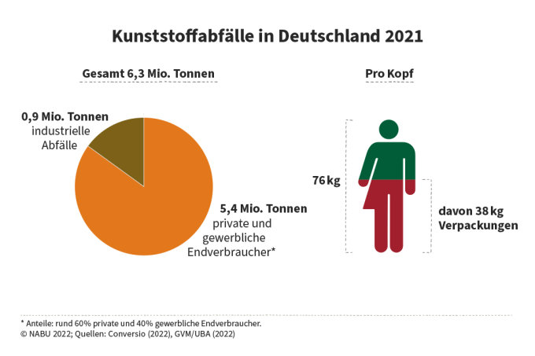

---
# You can also start simply with 'default'
theme: seriph
# random image from a curated Unsplash collection by Anthony
# like them? see https://unsplash.com/collections/94734566/slidev
background: plastic-ocean-background-2.jpg
# some information about your slides (markdown enabled)
# title: Müllrecycling in Deutschland auf Kosten anderer Länder?
# info: |
#  Idk bro
# apply unocss classes to the current slide
class: text-center
# https://sli.dev/features/drawing
drawings:
  persist: false
# slide transition: https://sli.dev/guide/animations.html#slide-transitions
transition: slide-left
# enable MDC Syntax: https://sli.dev/features/mdc
mdc: true
# take snapshot for each slide in the overview
overviewSnapshots: true
hideInToc: true
---

<h1>Müllrecycling in Deutschland auf Kosten anderer Länder?</h1>

#### Von Markus Siegert

<!--
The last comment block of each slide will be treated as slide notes. It will be visible and editable in Presenter Mode along with the slide. [Read more in the docs](https://sli.dev/guide/syntax.html#notes)
-->

---
transition: fade-out
hideInToc: true
---

# Gliederung

<Toc minDepth="1" maxDepth="2" :listStyle="['upper-alpha', 'lower-alpha']"></Toc>

---
transition: slide-up
---

# Plastikmüll in Deutschland

<!-- hier sind normale stats wie viel allgemein in deutschland und dann nochmal wie viel plastik und dann wie viel plastik exportiert wird -->
<!-- https://www.umweltbundesamt.de/daten/ressourcen-abfall/abfallaufkommen (Allgemeine Stats) -->
<!-- https://www.nabu.de/umwelt-und-ressourcen/abfall-und-recycling/26205.html (Stats zu exporten und plastik) -->
<!-- https://www.greenpeace.de/engagieren/nachhaltiger-leben/plastikmuellexporte-deutschland (experte am werk) -->

<!-- plastik exportiert zu 'anerkannten' recycling stationen im ausland zaehlt zur deutschen recycling quote. ( 2 ) -->
<!-- cool story firma in de exportiert nach tuerkei illegalen muell und geht insolvent. Muell bleibt in Tuerkei. ( 3 ) -->
<!-- 2.8% des Plastikmuells wird recycled. ( 3 ) -->
<!-- Basler Konvention -->
<!-- Die Recycling Luege -->
<!-- min 7 Expertenargument gegen Recycling warum es nicht funktionieren kann -->
<!-- min 8.15 6 millionene tonnen plastik muell -->
<!-- min 15 2.8% (3) - 5% aus dem gelben Sack werden wieder zu verwendbaren plastik gemacht. Grund ist zu schmutzige sachen wie Chips, Joghurt und gemuese schalen. -->
<!-- min 16 grosse firmen nehmen lieber billigeres material was direkt aus der produktion kommt. anstatt teures recyclestes material. -->
<!-- min 16.20 400 millionen neu plastik durch eine Produktionsstaette | geschaetzt 20% des Oels fuer plastik -->
<!-- min 19 Mischkunststoffe koennen nicht recycled werden. Man kann nicht aus Scheisse Gold machen, ausserdem stinkt das Zeug. Es gibt aber anwendungen dafuer naemlich z.b. eisenbahnschwellen. Aber selbst das ist nicht profitabel. -->
<!-- min 24 so verschmutzt dass eine stoffliche recyclung nicht mehr stattfinden kann und thermisch verwertet wird. Erstmal zerhackt und dann als ersatzbrennstoff genutzt. 70% des Brennstoffs von Zementherstellung wird so gewonnen. -->
<!-- min 26 Zementherstellung hat 3 mal mehr THG ausstoss als Flugzeuge betrieb -->
<!-- min 29 Energiegewinnung aus Restmuell und deswegen gruen. Nicht weil es umweltfreundlich ist, sondern weil es das Plastikproblem teilweise loest. -->
<!-- min 31 Exportierter Muell gilt auch als recycled -->
<!-- min 32 China hat dicht gemacht und jetzt andere laender wie Malaisia, Phillipinen usw aber die beschraenken jetzt auch. (Merkt man an der Quelle nabu in dem einen Jahr waren es 170 Tonnen in dem anderen nur noch 65 tonnen) -->
<!-- min 32.5 Tuerkei als haupt importer. und illegal ohne filter verbrannt. -->
<!-- min 45 es wird immer schwerer Mischkunststoffe zu exportieren (illegal) -->
<!-- Recycling ist die Illusion man hat ein Problem und Technologie loest sie aus Zauberhand. -->
<!-- Durch diese Fehlannahme wird es zu keiner wirklichen loesung kommen koennen denn es ist ja schon faelschlicherweise geloest. -->

<!-- |     |     | -->
<!-- | --- | --- | -->
<!-- | <kbd>right</kbd> / <kbd>space</kbd>| next animation or slide | -->
<!-- | <kbd>left</kbd>  / <kbd>shift</kbd><kbd>space</kbd> | previous animation or slide | -->
<!-- | <kbd>up</kbd> | previous slide | -->
<!-- | <kbd>down</kbd> | next slide | -->

<!-- <!-1- https://sli.dev/guide/animations.html#click-animation -1-> -->
<!-- 
<!--   v-click -->
<!--   class="absolute -bottom-9 -left-7 w-80 opacity-50" -->
<!--   src="https://sli.dev/assets/arrow-bottom-left.svg" -->
<!--   alt="" -->
<!-- /> -->
<!-- 
Here!
 -->

---
transition: slide-up
---

# Der Grüne Punkt
<v-switch class="midl">
  <template #0>
    
  </template>
  <template #1>
    

      <ul>
        <li><strong>Existiert seit</strong>: 90er Jahren.</li>
        <li><strong>Verwertung</strong>: 5,67t also 99,4% davon werden Verwertet.</li> % 99,4 stimmt nicht mit der Graphik davor ueberein aber so sagt es das UBA
      </ul>
    

    <Footer />
  </template>
</v-switch>

